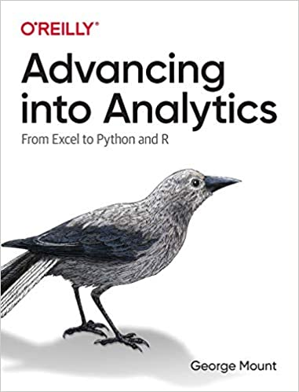

# Resources for _Advancing into Analytics_ Presentation to the PM Financial Modelling Meetup

### Follow along with the presentation by clicking following links: 

Run in RStudio: 

Run in Jupyter: 

## Want more? Check out my book, _Advancing into Analytics: From Excel to Python and R_.
### [Read the book for FREE and subscribe to my newsletter for your free "30 Days to Data Analyst" checklist.](http://stringfestanalytics.com/book)

